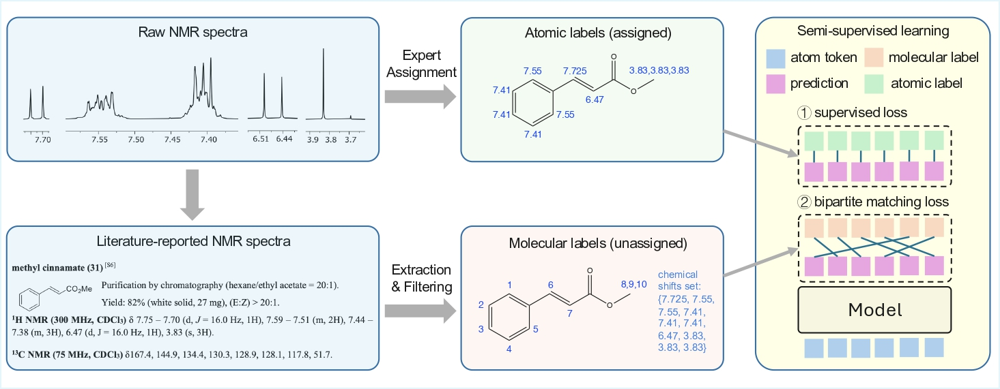

From Human Labels to Literature: Semi-Supervised Learning of NMR Chemical Shifts at Scale
==================================================

A semi-supervised framework for large-scale NMR chemical shift prediction.



## Environment & Dependencies
```bash
pip install -r requirements.txt
```

## Datasets & Weights
- Place pretrained weights in [`./weight`](./weight).
- Place datasets in [`./data`](./data); download from [Zenodo]().

## Running
- **H/C**  
  ```bash
  sh script/run_H.sh   # or run_C.sh
  ```
- **H/C with solvent**  
  ```bash
  sh script/run_H_solvent.sh
  ```
- **Heteroatoms (F / P / B / Si)**  
  ```bash
  sh script/run_heteroatoms.sh F   # or P/B/Si
  ```

## License
This project is licensed under the terms of the MIT license. See [LICENSE](./LICENSE) for additional details.
